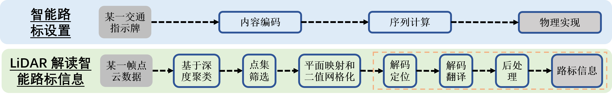
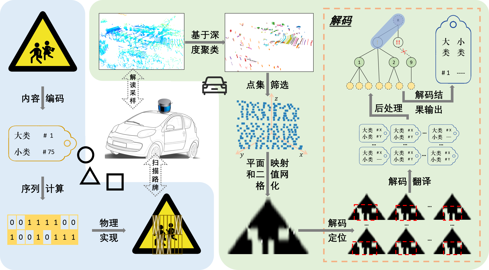

# 2021 Undergraduate Thesis

***LiCode: A Multimodality-Friendly Encoding Design for Traffic Signs***

========== SPECIAL THANKS ==========
Prof. *H.Y. Zhu* (Advisor)
*Y.X. Cai* (Assistant Advisor)
========== ❤❤❤❤❤❤❤❤❤ ========== 


<br>


**Table of Contents**
<!-- MarkdownTOC -->

- [2021 Undergraduate Thesis](#2021-undergraduate-thesis)
  - [File Tree](#file-tree)
  - [Quick Start](#quick-start)
    - [Workflow](#workflow)
    - [Links and HyperLinks](#links-and-hyperlinks)
  - [Update Logs](#update-logs)

<!-- /MarkdownTOC -->


<br>


<a id="file-tree"></a>
## File Tree


<details>
<summary>File Tree</summary>

```
📦Undergraduate Thesis                      // root directory `~/`
 ┣ 📂design_analysis                       // [DIRECTORY] general encoding design analysis (w.r.t. bars, distances, etc.)
 ┃ ┣ 📂__deprecated__                     // [DIRECTORY] deprecated implementations (wrapped in ~/design_analysis/*.py) 
 ┃ ┃ ┣ 📜2_by_1_encoding_2_per_bar.py    // deprecated
 ┃ ┃ ┣ 📜2_by_4_encoding_2_per_bar.py    // deprecated
 ┃ ┃ ┣ 📜2_by_5_encoding_1_per_bar.py    // deprecated
 ┃ ┃ ┗ 📜max_distance_calculation.py     // deprecated
 ┃ ┣ 📜level_1_duplicate_check.py         // [class-oriented] check for possible duplicate sampling results of the level-1 encodings, by means of numerical simulation (iteratively select starting location values and/or sample points margin values) (with examples in `__main__`)
 ┃ ┗ 📜max_dist_cal.py                    // [class-oriented] general calculator for the theoretically-possible level-1/2 encoding maximum working ranges (with examples in `__main__`)
 ┣ 📂detection                             // [DIRECTORY] detection, which: (1) extract sample points that fall on the encoding-embedded traffic sign boards, out of the raw LiDAR point cloud data; and then (2) post-process to acquire a matrix-like binary representation that can be further used to complete the decoding operations. ([NOTE] unless specified, all scripts/settings are for sequence #1/#6, frame 320/321/322)
 ┃ ┣ 📂data_prep                          // [DIRECTORY] data preparation, i.e., to convert `.csv` files (exported from the `.pcap` LiDAR files through RoboSense RSView) to `.pcd` files and further to `.bin` files (shared by CYX) ([ALERT] some dependencies rely on `pcd2bin2` conda virtual environment on the 9991 server)
 ┃ ┃ ┣ 📂bin                             // [DIRECTORY] converted `.bin` files
 ┃ ┃ ┃ ┗ 📂seq60
 ┃ ┃ ┃ ┃ ┣ 📜seq60_00000__320.bin       // sequence #1/#6 (file `2021-10-27-19-11-43-RS-32-Data.pcap`, filename omitted below), frame 320
 ┃ ┃ ┃ ┃ ┣ 📜seq60_00000__321.bin       // sequence #1/#6, frame 321
 ┃ ┃ ┃ ┃ ┗ 📜seq60_00000__322.bin       // sequence #1/#6, frame 322
 ┃ ┃ ┣ 📂csv                              // [DIRECTORY] exported `.csv` files
 ┃ ┃ ┃ ┣ 📜2021-10-27-19-11-43-RS-32-Data (Frame 0320).csv
 ┃ ┃ ┃ ┣ 📜2021-10-27-19-11-43-RS-32-Data (Frame 0321).csv
 ┃ ┃ ┃ ┣ 📜2021-10-27-19-11-43-RS-32-Data (Frame 0322).csv
 ┃ ┃ ┃ ┗ 📜2021-10-27-19-11-43-RS-32-Data.pcap
 ┃ ┃ ┣ 📂seq60                            // [DIRECTORY] converted `.pcd` files
 ┃ ┃ ┃ ┣ 📜320.pcd                       // sequence #1/#6, frame 320
 ┃ ┃ ┃ ┣ 📜321.pcd                       // sequence #1/#6, frame 321
 ┃ ┃ ┃ ┗ 📜322.pcd                       // sequence #1/#6, frame 322
 ┃ ┃ ┣ 📜csv2trackerRes.sh                // bash script to execute on the 9991 server (just for reference)
 ┃ ┃ ┣ 📜loadtypicalCSV.py                // script to convert `.csv` to `.pcd` ([NOTE] check the floating point accuracy and intensity normalization operations)
 ┃ ┃ ┗ 📜pcd2bin.py                       // script to convert `.pcd` to `.bin` ([ALERT] some dependencies rely on `pcd2bin2` conda virtual environment on the 9991 server)
 ┃ ┗ 📂my_detection                        // [DIRECTORY] detection operations
 ┃ ┃ ┣ 📂data                             // data files
 ┃ ┃ ┃ ┣ 📜0001.pcd                      // can be ignored
 ┃ ┃ ┃ ┣ 📜seq60_00000__1-320.bin        // sequence #1/#6, frame 320
 ┃ ┃ ┃ ┣ 📜seq60_00000__1-321.bin        // sequence #1/#6, frame 320
 ┃ ┃ ┃ ┣ 📜seq60_00000__1-322.bin        // sequence #1/#6, frame 320
 ┃ ┃ ┃ ┣ 📜seq60_00000__3-268.bin        // sequence #3/#6 (file `2021-10-27-19-14-57-RS-32-Data.pcap`, filename omitted below), frame 268
 ┃ ┃ ┃ ┗ 📜seq60_00000__3-297.bin        // sequence #3/#6, frame 297
 ┃ ┃ ┣ 📂plot_binary                      // [DIRECTORY] scripts to plot the binarized matrix-like representation of the traffic sign board sample points
 ┃ ┃ ┃ ┣ 📜binarized-old.png             // old example figure
 ┃ ┃ ┃ ┣ 📜binarized.png                 // example figure
 ┃ ┃ ┃ ┣ 📜binary.npy                    // data of the example representation
 ┃ ┃ ┃ ┗ 📜plot_binary.py                // script
 ┃ ┃ ┣ 📂tests                            // [DIRECTORY] some test scripts (omitted in version control)
 ┃ ┃ ┃ ┣ 📜cluster_dbscan.py             // generate clusters in the raw LiDAR point cloud, by means of DBSCAN
 ┃ ┃ ┃ ┣ 📜cluster_euclidean.py          // [todo] [copied from web] generate clusters in the raw LiDAR point cloud, according to the euclidean distances between points
 ┃ ┃ ┃ ┣ 📜cluster_euclidean_kdtree.py   // [todo] [copied from web] generate clusters in the raw LiDAR point cloud, according to the euclidean distances between points and using KD-tree
 ┃ ┃ ┃ ┣ 📜plane_open3d.py               // fit a plane for the given points, using `open3d` APIs
 ┃ ┃ ┃ ┣ 📜plane_sklearn-1.py            // [todo] fit a plane for the given points, using `sklearn` APIs (approach 1)
 ┃ ┃ ┃ ┣ 📜plane_sklearn-2.py            // [todo] fit a plane for the given points, using `sklearn` APIs (approach 1)
 ┃ ┃ ┃ ┣ 📜points.npy                    // points (which can be generally regarded as all those fall on the encoding-embedded traffic sign) for plane fitting
 ┃ ┃ ┃ ┣ 📜points_on_board_2d_distribution.py
 ┃ ┃ ┃ ┃                                 // visualize the 2d-distribution (w.r.t. fit line) of the given points, with z-axis removed
 ┃ ┃ ┃ ┣ 📜points_on_board_3d_distribution.py
 ┃ ┃ ┃ ┃                                 // [todo] visualize the 3d-distribution (w.r.t. fit plane) of the given points
 ┃ ┃ ┃ ┣ 📜points_on_off_board.py        // scripts to check whether: (1) all off-board points are mapped to range image pixels `P`; (2) there exist some on-board points that map to each range image pixel `p \in P`
 ┃ ┃ ┃ ┣ 📜points_proj_dup_cnt.npy       // a matrix of a size the same as the range image, where each element is the number of points (in the raw point cloud) that are mapped to the range image pixel at the corresponding location
 ┃ ┃ ┃ ┣ 📜points_xyz_off_board.npy      // all off-board points (selected by empirical coordinates threshold criterions)
 ┃ ┃ ┃ ┣ 📜points_xyz_on_board.npy       // all on-board points (selected by empirical coordinates threshold criterions)
 ┃ ┃ ┃ ┣ 📜projection_example.py         // [todo] [copied from web] some seemingly-working plane projection codes
 ┃ ┃ ┃ ┣ 📜range_data.npy                // range image data
 ┃ ┃ ┃ ┣ 📜show_points_dup_cnt.py        // visualize the representing image of file `points_proj_dup_cnt.npy`
 ┃ ┃ ┃ ┗ 📜show_range_image.py           // visualize the representing range image of file `range_data.npy`
 ┃ ┃ ┣ 📂utils                            // [DIRECTORY] opne3d-oriented 3d point cloud visualization: reference scripts, setting files, etc.
 ┃ ┃ ┃ ┣ 📂pt_cloud_color_bar            // [DIRECTORY] images of the color bars used while visualizing point clouds by the intensity of each point
 ┃ ┃ ┃ ┣ 📜BV_1440.json                  // can be neglected
 ┃ ┃ ┃ ┣ 📜camera-plate.json             // camera settings (angle of view) used while visualizing traffic sign board points
 ┃ ┃ ┃ ┣ 📜camera_option-old.json        // can be neglected
 ┃ ┃ ┃ ┣ 📜camera_option.json            // camera settings (angle of view) used while visualizing the entire raw point cloud
 ┃ ┃ ┃ ┗ 📜open3d_view.py                // [copied from web] reference codes to: (1) create camera settings; (2) use existing camera settings
 ┃ ┃ ┣ 📜board_extractor.py               // scripts to extract all the sample points that fall on encoding-embedded traffic sign boards, out of the entire point cloud
 ┃ ┃ ┣ 📜data_loader.py                   // `.bin` point cloud file data loader 
 ┃ ┃ ┣ 📜do_extraction.py                 // entry scripts for the detection operations
 ┃ ┃ ┣ 📜plane_projection.py              // scripts to post-process the extracted points (that fall on the encoding-embedded traffic sign boards), so as to acquire the matrix-like binary representation
 ┃ ┃ ┣ 📜point_cloud_visualization.py     // utilities for visualizing point cloud data
 ┃ ┃ ┗ 📜test.py                          // can be ignored
 ┣ 📂environment                            // environment setting scripts for RoboSense LiDAR device
 ┃ ┣ 📜IP Settings.PNG                     // demonstration of the required static IP address settings
 ┃ ┣ 📜Restore IP Address to DHCP.bat      // scripts to restore static IP address to DHCP
 ┃ ┗ 📜Set IP Address.bat                  // set IP address to the required static one
 ┣ 📂simulation                             // [DIRECTORY] simulation: (1) traffic sign board contents => categorized (level-1/2/3) indices; (2) categorized indices => embedded encodings to be placed onto traffic sign boards of the corresponding shapes; (3) sample at different distances; (4) w.r.t. the sampled results, attempt to decode, so as to extract the corresponding traffic sign contents
 ┃ ┣ 📂analysis                             // [DIRECTORY] analyze sampling properties or encoding designs
 ┃ ┃ ┣ 📜advanced_property_search.py       // [todo] scripts to search for encoding designs with advanced properties
 ┃ ┃ ┣ 📜lidar_resolution_analysis.py      // scripts to analyze the line resolution of LiDAR at different distances
 ┃ ┃ ┣ 📜sample_cnt_analysis.py            // scripts to analyze the difference of the number of sample points that fall on each bar (more specifically, adjacent bars) of the encodings
 ┃ ┃ ┣ 📜sample_cnt_analysis__avg.png      // result image of `sample_cnt_analysis.py`: avergae difference
 ┃ ┃ ┣ 📜sample_cnt_analysis__cnt_cnt_cat.png
 ┃ ┃ ┣                                     // result image of `sample_cnt_analysis.py`: difference by value
 ┃ ┃ ┣ 📜sample_cnt_analysis__max.png      // result image of `sample_cnt_analysis.py`: maximum difference
 ┃ ┃ ┗ 📜sample_cnt_analysis__min.png      // result image of `sample_cnt_analysis.py`: minimum difference
 ┃ ┣ 📂data_v1                              // [DIRECTORY] VERSION-1 encoding schema of traffic sign board contents (i.e. contents => level-1/2/3 categorized indices)
 ┃ ┃ ┣ 📜classification.png                // Chinese traffic sign board classifications, from paper **Traffic-Sign Detection and Classification in the Wild__CVPR 2016*
 ┃ ┃ ┣ 📜constants.py                      // constants of the encoding schema
 ┃ ┃ ┗ 📜taffic_signs.py                   // [class-oriented] utilities of the encoding schema (with examples in `__main__`)
 ┃ ┣ 📂data_v2                              // [DIRECTORY] VERSION-2 encoding schema of traffic sign board contents (i.e. contents => level-1/2/3 categorized indices)
 ┃ ┃ ┣ 📜constants.py                      // constants of the encoding schema
 ┃ ┃ ┗ 📜taffic_signs.py                   // [class-oriented] utilities of the encoding schema (with examples in `__main__`)
 ┃ ┣ 📂encoding_v1_1                        // [DIRECTORY] [deprecated] VERSION-1-1 traffic sign board content indices => on-board embedded encodings
 ┃ ┃ ┣ 📜encode_v1_1.py                    // encoder scripts
 ┃ ┃ ┗ 📜__init__.py                       // to make it package alike
 ┃ ┣ 📂encoding_v1_2                        // [DIRECTORY] VERSION-1-2 traffic sign board content indices => on-board embedded encodings (3 levels)
 ┃ ┃ ┣ 📜decode_v1_2.py                    // decoder scripts
 ┃ ┃ ┣ 📜encode_v1_2.py                    // encoder scripts
 ┃ ┃ ┣ 📜pattern_v1_2.py                   // level-1 encoding patterns
 ┃ ┃ ┣ 📜substring_match_BM.py             // scripts for sub-string matching, by means of Boyer-Moore Algorithm
 ┃ ┃ ┗ 📜__init__.py                       // to make it package alike
 ┃ ┣ 📂encoding_v2_1                        // [DIRECTORY] [deprecated] VERSION-2-1 traffic sign board content indices => on-board embedded encodings (2 levels)
 ┃ ┃ ┣ 📜back_trace_min_ex.py              // minimum example of the back tracing method used in decoding
 ┃ ┃ ┣ 📜decode_v2_1_ver1.py               // decoder scripts version-1: can be ignored
 ┃ ┃ ┣ 📜decode_v2_1_ver2_0.py             // decoder scripts version-2-0: (1) brute force starting locations to extract points that fall on the encodings part only; (2) brute force starting locations to decode
 ┃ ┃ ┣ 📜decode_v2_1_ver2_1.py             // decoder scripts version-2-1: (1) back-trace to extract points that fall on the encodings part only; (2) brute force starting locations to decode
 ┃ ┃ ┣ 📜decode_v2_1_ver3.py               // decoder scripts version-3: (1) back-trace to extract points that fall on the encodings part only; (2) decode by the sample-point-to-binary-bit combining scehma deteremined by the back-tracing extraction results
 ┃ ┃ ┣ 📜encode_v2_1.py                    // encoder scripts
 ┃ ┃ ┣ 📜pattern_v2_1.py                   // level-1 encoding patterns
 ┃ ┃ ┣ 📜substring_match_BM.py             // scripts for sub-string matching, by means of Boyer-Moore Algorithm
 ┃ ┃ ┗ 📜__init__.py                       // to make it package alike
 ┃ ┣ 📂tests                                // [DIRECTORY] scripts to run simulations of all encoder & decoder implementation
 ┃ ┃ ┣ 📂canvas_img                        // [DIRECTORY] images of simulated traffic sign boards with embedded encodings
 ┃ ┃ ┃ ┣ 📜canvas_v1_1.png                // VERSION-1-1
 ┃ ┃ ┃ ┣ 📜canvas_v1_2.png                // VERSION-1-2
 ┃ ┃ ┃ ┣ 📜canvas_v2_1.png                // VERSION-2-1
 ┃ ┃ ┃ ┣ 📜canvas_v2_1__cir00.png         // VERSION-2-1: circle (without scaled height; without optimal height:width ratio)
 ┃ ┃ ┃ ┣ 📜canvas_v2_1__cir01.png         // VERSION-2-1: circle (without scaled height; with optimal height:width ratio)
 ┃ ┃ ┃ ┣ 📜canvas_v2_1__cir10.png         // VERSION-2-1: circle (with scaled height; without optimal height:width ratio)
 ┃ ┃ ┃ ┣ 📜canvas_v2_1__cir11.png         // VERSION-2-1: circle (with scaled height; with optimal height:width ratio)
 ┃ ┃ ┃ ┣ 📜canvas_v2_1__rect00.png        // VERSION-2-1: rectangle (without scaled height; without optimal height:width ratio)
 ┃ ┃ ┃ ┣ 📜canvas_v2_1__rect01.png        // VERSION-2-1: rectangle (without scaled height; with optimal height:width ratio)
 ┃ ┃ ┃ ┣ 📜canvas_v2_1__rect10.png        // VERSION-2-1: rectangle (with scaled height; without optimal height:width ratio)
 ┃ ┃ ┃ ┣ 📜canvas_v2_1__rect11.png        // VERSION-2-1: rectangle (with scaled height; with optimal height:width ratio)
 ┃ ┃ ┃ ┣ 📜canvas_v2_1__tri00.png         // VERSION-2-1: triangke (without scaled height; without optimal height:width ratio)
 ┃ ┃ ┃ ┣ 📜canvas_v2_1__tri01.png         // VERSION-2-1: triangke (without scaled height; with optimal height:width ratio)
 ┃ ┃ ┃ ┣ 📜canvas_v2_1__tri10.png         // VERSION-2-1: triangke (with scaled height; without optimal height:width ratio)
 ┃ ┃ ┃ ┗ 📜canvas_v2_1__tri11.png         // VERSION-2-1: triangke (with scaled height; with optimal height:width ratio)
 ┃ ┃ ┣ 📜plot_binary.py                    // sciipts to plot the given sample results (all as binary pits)
 ┃ ┃ ┣ 📜sample.npy                        // example sample results
 ┃ ┃ ┣ 📜sample_binarized.png              // plot of `sample.npy` by `plot_binary.py`
 ┃ ┃ ┣ 📜test_encoding_v1_1.py             // entry scripts of running simulation for encoding schema VERSION-1-1
 ┃ ┃ ┣ 📜test_encoding_v1_2.py             // entry scripts of running simulation for encoding schema VERSION-1-2
 ┃ ┃ ┣ 📜test_encoding_v2_1_ver1.py        // entry scripts of running simulation for encoding schema VERSION-2-1, using decoder version-1
 ┃ ┃ ┣ 📜test_encoding_v2_1_ver2_0.py      // entry scripts of running simulation for encoding schema VERSION-2-1, using decoder version-2-0
 ┃ ┃ ┣ 📜test_encoding_v2_1_ver2_1.py      // entry scripts of running simulation for encoding schema VERSION-2-1, using decoder version-2-1
 ┃ ┃ ┗ 📜test_encoding_v2_1_ver3.py        // entry scripts of running simulation for encoding schema VERSION-2-1, using decoder version-2
 ┃ ┣ 📂tests_plots                          // [DIRECTORY] simulation result plots
 ┃ ┃ ┣ 📂plots                             // [DIRECTORY] simulation result plots
 ┃ ┃ ┣ 📜draw.py                           // scripts to plot simulation results
 ┃ ┃ ┣ 📜raw_results-before avlid debug.txt// can be ignored, old results
 ┃ ┃ ┣ 📜raw_results.txt                   // simulation results of encoding schema VERSION-2-1, using deocder version-2-0 and version-2-1
 ┃ ┃ ┗ 📜raw_results_v3.txt                // simulation results of encoding schema VERSION-2-1, using deocder version-3
 ┃ ┣ 📜exceptions.py                        // scripts implementing exceptions that will possibly occur during decoding
 ┃ ┣ 📜lidar_points.py                      // [class-oriented] scripts simulating LiDAR sampling at different distances (with examples in `__main__`)
 ┃ ┣ 📜sign_boards.py                       // [class-oriented] scripts simulating placing encodings onto traffic sign boards (with examples in `__main__`)
 ┃ ┣ 📜test.py                              // can be ignored
 ┃ ┣ 📜utils.py                             // scripts implementing some utilities
 ┃ ┗ 📜visualization.py                     // [class-oriented] scripts implementing the visulaization of encoding-embedded traffic sign boards (with examples in `__main__`)    
 ┣ 📜.gitignore                              // git ignore file
 ┗ 📜README.md                               // readme file
```

</details>


<br>


<a id="quick-start"></a>
## Quick Start


<a id="workflow"></a>
### Workflow

<details>
<summary>Workflow Illustration</summary>




[**Note**] in the illustration above:
+ encoding schema (traffic sign boards contents => categorized indices) used are implemented in [data_v2](./simulation/data_v2/)
+ encoder (categorized indices => 2-level encodings) are implemented in [link](./simulation/encoding_v2_1/encode_v2_1.py)

</details>


<a id="links-and-hyperlinks"></a>
### Links and HyperLinks

+ **FULL UTILITIES** (2022-07-10: inaccessible): [Github](https://github.com/marridG/2021-Undergraduate-Thesis) (Starring of ANY related repositories are appreciated)
+ **RoboSense LiDAR use**
  + docs: [RS-LiDAR-16](https://www.robosense.cn/resources-27), [RS-LiDAR-32](https://www.robosense.cn/resources-24)
  + set IP address: [link](environment/Set%20IP%20Address.bat)
  + restore IP address: [link](environment/Restore%20IP%20Address%20to%20DHCP.bat)
+ **encoding design analysis**
  + maximum working distance: [link](./design_analysis/max_dist_cal.py)
+ **detection**
   + data preparation (`.pcap` \==RoboSense-RSView==> `.csv` ==> `.pcd`/`.bin`): [link](./detection/data_prep/)
   + points extraction: [link](./detection/my_detection/do_extraction.py)
+ **encoder + decoder simulation** (encoding schema VERSION-2-1, decoder version-3)
  + simulation: [link](./simulation/tests/test_encoding_v2_1_ver3.py)
  + demonstration of encoding-embedded traffic sign boards: [link](./simulation/tests/canvas_img/canvas_v2_1__tri11.png)
    + traffic sign board contents => categorized indices: [link](./simulation/data_v2/taffic_signs.py)
    + categorized indices => 2-level encodings: [link](./simulation/encoding_v2_1/encode_v2_1.py)
    + 2-level encodings => demonstration image: [link](simulation/visualization.py)
  + plot simulation results: [link](./simulation/tests_plots/draw.py)


<br>

<a id="update-logs"></a>
## Update Logs

<details>
<summary>Update Logs</summary>

+ *Mon Jun 27 18:45:50 2022*:
    - **[DESCRIPTION]** rename `.bin` files & uodate `do_extraction.py` correspondingly
+ *Mon Jun 27 11:05:05 2022*:
    - **[DESCRIPTION]** in `plane_projection.py`: annotate visualization for plane fitting point removal
+ *Mon Jun 27 11:03:21 2022*:
    - **[DESCRIPTION]** in `plane_projection.py`: (1) add point removal for plane fitting; (2) bug fix: wrong points selection after statistical outlier removal
+ *Mon Jun 27 10:32:26 2022*:
    - **[DESCRIPTION]** in `plane_projection.py`: add on-off board points splitter as the very beggining
+ *Mon Jun 27 10:29:43 2022*:
    - **[DESCRIPTION]** in `board_extractor.py`: finish modifications: add visualization results of no-missing points
+ *Tue Jun 21 19:55:28 2022*:
    - **[DESCRIPTION]** in file `plane_projection.py`: some plane fitting attempts (not that successful)
+ *Tue Jun 21 19:50:50 2022*:
    - **[DESCRIPTION]** in file `plane_projection.py`: enable point cloud visualization, where points are colored by intensity values; some plane fitting attempts (not that successful)
+ *Tue Jun 21 19:47:52 2022*:
    - **[DESCRIPTION]** in file `board_extractor.py`: (1) [bug fix] fix missing 3D points corresponding to 2D clusters; (2) [visualization] add visualization at each step (colored by intensity). TODO: update visualization correspondingly
+ *Tue Jun 21 19:44:34 2022*:
    - **[DESCRIPTION]** in file `do_extraction.py`: modify filenames for data of different frames; modify raw data visualization by limiting the visible point cloud range to provide better observation for the test plate
+ *Tue Jun 21 19:42:46 2022*:
    - **[DESCRIPTION]** ignore `.pkl` files & remove previously added `extract_results.pkl`
+ *Tue Jun 21 19:29:52 2022*:
    - **[DESCRIPTION]** ignore `.pcap`, `.csv` files
+ *Tue Jun 21 11:15:10 2022*:
    - **[DESCRIPTION]** add more data: frame #320, #322
+ *Fri Jun 17 10:41:33 2022*:
    - **[DESCRIPTION]** update `.gitignore`: ignore test scripts in detection
+ *Mon Jun 13 14:48:49 2022*:
    - **[DESCRIPTION]** `in design_analysis/max_dist_cal.py`: add method `cal_dist_by_hw`, which calculate the maximum distance by the given bar height and width, regardless of the shape
+ *Mon Jun 13 10:57:07 2022*:
    - **[DESCRIPTION]** in `design_analysis/max_dist_cal.py`: add some default values
+ *Mon Jun 13 10:53:12 2022*:
    - **[DESCRIPTION]** in `design_analysis/max_dist_cal.py`: add some annotations
+ *Mon Jun 13 10:48:29 2022*:
    - **[DESCRIPTION]** in `design_analysis/max_dist_cal.py`: allow changing default sign board sizes; make bar height&width calculation method public
+ *Sat Jun 11 21:32:08 2022*:
    - **[DESCRIPTION]** finish max distance calculation: (1) calculation; (2) optimal ratio finder
+ *Sat Jun 11 16:42:37 2022*:
    - **[DESCRIPTION]** add deprecated files of design analysis
+ *Sat Jun 11 15:37:17 2022*:
    - **[DESCRIPTION]** finish max distance calculation. further todo: best height:width ratio finder
+ *Thu Jun 9 20:53:12 2022*:
    - **[DESCRIPTION]** init max distance calculation. todo: test, optimal ratio numerical validator
+ *Thu Jun 9 17:46:43 2022*:
    - **[DESCRIPTION]** add numerical simulation for possible duplicate sample results of level 1 sequences
+ *Mon Jun 13 14:48:49 2022*:
    - **[DESCRIPTION]** in `design_analysis/max_dist_cal.py`: add method `cal_dist_by_hw`, which calculate the maximum distance by the given bar height and width, regardless of the shape
+ *Mon Jun 13 10:57:07 2022*:
    - **[DESCRIPTION]** in `design_analysis/max_dist_cal.py`: add some default values
+ *Mon Jun 13 10:53:12 2022*:
    - **[DESCRIPTION]** in `design_analysis/max_dist_cal.py`: add some annotations
+ *Mon Jun 13 10:48:29 2022*:
    - **[DESCRIPTION]** in `design_analysis/max_dist_cal.py`: allow changing default sign board sizes; make bar height&width calculation method public
+ *Sat Jun 11 21:32:08 2022*:
    - **[DESCRIPTION]** finish max distance calculation: (1) calculation; (2) optimal ratio finder
+ *Sat Jun 11 16:42:37 2022*:
    - **[DESCRIPTION]** add deprecated files of design analysis
+ *Sat Jun 11 15:39:20 2022*:
    - **[DESCRIPTION]** remove local pole-localization repo clone
+ *Sat Jun 11 15:37:17 2022*:
    - **[DESCRIPTION]** finish max distance calculation. further todo: best height:width ratio finder
+ *Thu Jun 9 20:53:12 2022*:
    - **[DESCRIPTION]** init max distance calculation. todo: test, optimal ratio numerical validator
+ *Thu Jun 9 17:46:43 2022*:
    - **[DESCRIPTION]** add numerical simulation for possible duplicate sample results of level 1 sequences
+ *Mon Jun 6 20:07:10 2022*:
    - **[DESCRIPTION]** add binary sample result plot drawer
+ *Mon Jun 6 20:05:16 2022*:
    - **[DESCRIPTION]** add plot drawer: no titles + larger labels version, for circle-11X only
+ *Mon Jun 6 20:03:57 2022*:
    - **[DESCRIPTION]** adjust plot margin settings
+ *Mon Jun 6 20:01:29 2022*:
    - **[DESCRIPTION]** add decoder timer
+ *Mon Jun 6 19:56:59 2022*:
    - **[DESCRIPTION]** add binary results plotter
+ *Mon Jun 6 19:56:43 2022*:
    - **[DESCRIPTION]** slight directory updates: move color bars for point cloud visualization to `utils/pt_cloud_color_bar`
+ *Mon Jun 6 19:53:49 2022*:
    - **[DESCRIPTION]** add open3d camera settings for sign boards view only
+ *Mon Jun 6 19:49:37 2022*:
    - **[DESCRIPTION]** ignore `*.npy`
+ *Mon Jun 6 19:49:00 2022*:
    - **[DESCRIPTION]** add point cloud visualizer: point color by intensity
+ *Mon Jun 6 19:48:15 2022*:
    - **[DESCRIPTION]** add timer for the detection scripts
+ *Sat May 14 16:39:12 2022*:
    - **[DESCRIPTION]** Merge branch 'detection_pole'
+ *Sat May 14 16:34:32 2022*:
    - **[DESCRIPTION]** plane projection codes TO-BE-DEBUGGED
+ *Sat May 14 16:14:41 2022*:
    - **[DESCRIPTION]** in file `lidar_resolution_analysis.py`: change some settings for thesis writing
+ *Sun May 8 19:26:33 2022*:
    - **[DESCRIPTION]** board extraction: add camera options for the visualizer
+ *Sun May 8 19:26:07 2022*:
    - **[DESCRIPTION]** board extraction: finish the board extractor and useful visualizer
+ *Sun May 8 19:24:26 2022*:
    - **[DESCRIPTION]** board extraction: finish the data loader for `.bin` files
+ *Sun May 8 19:23:27 2022*:
    - **[DESCRIPTION]** finish data prep (scripts are run on server) & get the result `.pcd` and `.bin` files from the given `.csv` file
+ *Sun May 8 19:22:06 2022*:
    - **[DESCRIPTION]** finish pole-localization repo understanding
+ *Thu May 5 15:16:37 2022*:
    - **[DESCRIPTION]** init pole localization repo
+ *Thu May 5 15:07:09 2022*:
    - **[DESCRIPTION]** draw some plots
+ *Thu May 5 15:06:08 2022*:
    - **[DESCRIPTION]** update to-be-avoided indices & modify correspondingly
+ *Thu May 5 15:04:35 2022*:
    - **[DESCRIPTION]** finish decoder v3 for encoding v2.1
+ *Fri Apr 22 09:47:34 2022*:
    - **[DESCRIPTION]** init plot drawing scripts: in file `draw.py`, also update .gitignore to ignore `.txt` data files
+ *Fri Apr 22 09:42:46 2022*:
    - **[DESCRIPTION]** init decoder V2-ver3. decoder WORKFLOW: deocde by back trace
+ *Thu Apr 21 18:54:56 2022*:
    - **[DESCRIPTION]** slight updates in file `data_v2/constants.py`
+ *Wed Apr 20 18:29:59 2022*:
    - **[DESCRIPTION]** init & finish ver2-1 decoder & test scripts. detection in decoder: detect & slice by starting 0 in the first category_1 line
+ *Wed Apr 20 18:28:33 2022*:
    - **[DESCRIPTION]** rename ver2 decoder to ver2_0; add batch test runner in file `test_encoding_v2_1_ver2_0.py`; bug fix in file `decode_v2_1_ver2_0.py`: failed to remove bottom all-one lines, wrong calculation of maximum lines of sample points on the encoding part if scale height is used
+ *Sun Apr 17 21:57:28 2022*:
    - **[DESCRIPTION]** init encoding v2.1 ver3 decoder. decoder WORKFLOW: raw points -> decode by starting 0 to find patterns -> slice raw points -> iteratively decode
+ *Sun Apr 17 21:56:46 2022*:
    - **[DESCRIPTION]** add codes for avoid-divide-by-zero problem & round(0.5)=0/1 problem BUT NOT implemented (still remain annotated)
+ *Sun Apr 17 21:55:40 2022*:
    - **[DESCRIPTION]** test something in file `pattern_v2_1.py` BUT nothing is changed w.r.t. the general behaviour
+ *Sun Apr 17 21:52:51 2022*:
    - **[DESCRIPTION]** finish encoding v2.1 ver1 decoder debug for extremely bad accuracy at 10-30m: previously failed to remove above all-one lines, PLUS influence-unknown factors (hori starting loc range, round(0.5)=0/1, whether to stop once 1 pattern is found). decoder WORKFLOW: raw points -> iteratively decode to find patterns -> slice decoded points
+ *Sun Apr 17 21:50:14 2022*:
    - **[DESCRIPTION]** finish encoding-v2.1 ver2 decoder & part statistical tests: raw points -> iteratively decode to find patterns -> slice raw points -> iteratively decode
+ *Sun Apr 17 15:38:42 2022*:
    - **[DESCRIPTION]** add vert/hori step size settings in method `sample_at_distance()` in file `lidar_points.py`
+ *Thu Apr 14 15:59:34 2022*:
    - **[DESCRIPTION]** enable cnt delta swith, all ones switch
+ *Mon Apr 11 12:56:07 2022*:
    - **[DESCRIPTION]** slight plot labels updates, in file `sample_cnt_analysis.py`
+ *Sun Apr 10 18:49:11 2022*:
    - **[DESCRIPTION]** slight updates: add assertion that the number of bars is not ZERO, in method `decode_one_line()` in file utils.py
+ *Sun Apr 10 18:36:16 2022*:
    - **[DESCRIPTION]** slight error update for No-Zero-In-Sample-Points in method `decode()` in file `decode_v2_1.py`: change AssertionError to DecodeFailure
+ *Sun Apr 10 18:25:25 2022*:
    - **[DESCRIPTION]** [Tested] enable decoder for triangle & circle boards
+ *Sat Apr 9 17:35:49 2022*:
    - **[DESCRIPTION]** update encoding v2.1 test codes for more settings
+ *Sat Apr 9 14:46:15 2022*:
    - **[DESCRIPTION]** update to enable placing encodings onto triangle&circle traffic sign boards
+ *Sat Apr 9 14:44:53 2022*:
    - **[DESCRIPTION]** slight debug message updates
+ *Fri Apr 8 11:22:56 2022*:
    - **[DESCRIPTION]** add naive search codes for possible advanced properties, as in file: `advanced_property_search.py`
+ *Fri Apr 8 11:21:56 2022*:
    - **[DESCRIPTION]** move all analysis-related files to `~/simulation/analysis/`
+ *Fri Apr 8 10:19:16 2022*:
    - **[DESCRIPTION]** slight updates for scaled height test support
+ *Fri Apr 8 10:18:31 2022*:
    - **[DESCRIPTION]** bug fix in decode_v2_1.py: (1) iter hori starting point range, TO min(schema_width, margin); (2) is_complete info of tolerated results
+ *Fri Apr 8 10:17:02 2022*:
    - **[DESCRIPTION]** add analysis for the delta of the number of sampled points that fall into each bar, as in: `sample_cnt_analysis.py`
+ *Thu Apr 7 14:50:36 2022*:
    - **[DESCRIPTION]** finish encoding v2.1 (rectangle)
+ *Sun Apr 3 21:28:07 2022*:
    - **[DESCRIPTION]** lidar points sampling: slight debug message updates
+ *Sun Apr 3 21:20:08 2022*:
    - **[DESCRIPTION]** lidar points sampling: slight debug message updates
+ *Sun Apr 3 20:59:19 2022*:
    - **[DESCRIPTION]** encoding v2.1: finish draft version of the entire en/decoding&test, under the condition that a "overflowing" number of points (hori&vert) are sampled. TODO: fewer sampled points cases, different encoding height on the board
+ *Sun Apr 3 20:56:25 2022*:
    - **[FILES]**: [traffic_signs.py](./simulation/data_v2/traffic_signs.py)
    - **[DESCRIPTION]** fix bugs in data v2 `traffic_signs.py`: in method `get_sign_info_by_idx()`, "is_complete" info is missing in the returned results
+ *Sun Apr 3 20:55:17 2022*:
    - **[DESCRIPTION]** add newly-found TODO problems to v1.2 decoding
+ *Sun Apr 3 16:17:46 2022*:
    - **[DESCRIPTION]** fix message-printing bugs in data v2
+ *Sun Apr 3 15:14:55 2022*:
    - **[DESCRIPTION]** fix import bugs in data v2
+ *Sun Apr 3 15:12:47 2022*:
    - **[DESCRIPTION]** add encoding v2.1 (codes copied from v1.2); finish the encoding + pattern parts
+ *Fri Apr 1 10:27:20 2022*:
    - **[DESCRIPTION]** slight filenames updates for previously committed encoding designs version name changes
+ *Fri Apr 1 09:30:21 2022*:
    - **[DESCRIPTION]** add data_v2
+ *Fri Apr 1 09:25:48 2022*:
    - **[DESCRIPTION]** rename data encoding: data->data_v1
+ *Fri Apr 1 09:24:28 2022*:
    - **[DESCRIPTION]** rename encoding designs: v1->v1_1, v2->v1_2
+ *Fri Apr 1 09:15:04 2022*:
    - **[DESCRIPTION]** remove all codes in `test.py`
+ *Fri Apr 1 09:14:52 2022*:
    - **[DESCRIPTION]** statistical successful rate analysis
+ *Sun Mar 27 19:38:23 2022*:
    - **[DESCRIPTION]** almost finish V2 encoding: both encoding & decoding & test
+ *Sun Mar 27 19:37:43 2022*:
    - **[DESCRIPTION]** add some annotations
+ *Sun Mar 27 18:40:29 2022*:
    - **[DESCRIPTION]** add handlers of traffic signs (& add annotations): extract sign str info by category_1, category_2(local ref idx) and/or num indices
+ *Sun Mar 27 17:14:44 2022*:
    - **[DESCRIPTION]** modify LiDAR sampling: add location info, delete distance->margin functions; modify `test_encoding_v1.py` accordingly
+ *Sun Mar 27 17:11:05 2022*:
    - **[FILES]**: [exceptions.py](./simulation/exceptions.py)
    - **[DESCRIPTION]** finish `exceptions.py`: decode errors
+ *Wed Mar 16 23:35:36 2022*:
    - **[DESCRIPTION]** finish v2 encoding implementation
+ *Wed Mar 16 22:34:58 2022*:
    - **[DESCRIPTION]** slight updates: filename edit
+ *Wed Mar 16 22:34:25 2022*:
    - **[DESCRIPTION]** move encodings test scripts to `~/simulation/tests/`
+ *Wed Mar 16 18:12:49 2022*:
    - **[DESCRIPTION]** reformat data codes
+ *Wed Mar 16 17:49:52 2022*:
    - **[DESCRIPTION]** init v2 encoding
+ *Wed Mar 16 17:49:23 2022*:
    - **[FILES]**: [.gitignore](./.gitignore)
    - **[DESCRIPTION]** update .gitignore
+ *Wed Mar 16 17:48:53 2022*:
    - **[DESCRIPTION]** end of encoding v1
+ *Mon Mar 7 23:00:41 2022*:
    - **[FILES]**: [traffic_signs.py](./simulation/data_v1/taffic_signs.py)
    - **[DESCRIPTION]** rename class in `traffic_signs.py`: TrafficSigns to TrafficSignsData
+ *Mon Mar 7 23:00:32 2022*:
    - **[DESCRIPTION]** finish encoding v1
+ *Mon Mar 7 22:43:53 2022*:
    - **[DESCRIPTION]** change numbers on traffic signs to "discrete" distributions
+ *Mon Mar 7 21:53:35 2022*:
    - **[DESCRIPTION]** finish sampling the whole canvas; add several lines of annotation in visualization.py
+ *Mon Mar 7 20:53:34 2022*:
    - **[DESCRIPTION]** remove the "bright" color, which should be identical to that of the board
+ *Wed Mar 2 20:20:20 2022*:
    - **[DESCRIPTION]** add utils: degree <-> radian conversion
+ *Wed Mar 2 19:39:19 2022*:
    - **[DESCRIPTION]** something on lidar resolution analysis: line resolution w.r.t distance, angle resolution, sign size
+ *Tue Mar 1 13:00:04 2022*:
    - **[DESCRIPTION]** finish visualization codes: base "abstract-like" class, traffic sign boards
+ *Sun Feb 27 19:09:04 2022*:
    - **[DESCRIPTION]** finish encoding of the traffic signs (as "data")
+ *Sun Feb 27 15:15:03 2022*:
    - **[DESCRIPTION]** add environment setting bash scripts for LiDAR hardware
+ *Sun Feb 27 15:14:27 2022*:
    - **[FILES]**: [.gitignore](./.gitignore)  
    - **[DESCRIPTION]** add .gitignore
+ *Thu Jan 13 10:25:15 2022*:
    - **[DESCRIPTION]** Initial commit


</details>

